# Spring Tutorial 教學專案

以製造業製造執行系統（Manufacturing Execution System）為領域範例，透過 Maven 多模組架構，漸進式展示 **DDD 戰術設計**、**六角形架構**、**CQRS** 與 **SOLID 原則**。

## 技術棧

| 技術 | 版本 | 用途 |
|---|---|---|
| JDK | 1.8 | 基礎執行環境 |
| Spring Boot | 2.7.18 | 應用程式框架 |
| Spring Cloud | 2021.0.9 (Jubilee) | 微服務基礎設施 |
| Spring Security | Boot 管理 | 認證與授權 (Module 5) |
| Spring Cloud Gateway | Cloud 管理 | API 閘道 (Module 6) |
| Spring Data Redis | Boot 管理 | 快取層 (Module 7) |
| Spring Cloud Alibaba | 2021.0.6.0 | 微服務治理 (Module 8) |
| MyBatis Starter | 2.3.2 | 持久層 (Module 3) |
| H2 Database | Boot 管理 | 測試用記憶體資料庫 |
| Lombok | Boot 管理 | 簡化樣板程式碼 |

## 專案結構

```
spring2-learning/                   (Parent POM)
│
│  ── 基礎層 ──────────────────────────────────────
├── mes-common/                     共用 DDD / CQRS 基礎類別（Shared Kernel）
│
│  ── 核心模組（DDD + 六角形 + CQRS）─────────────────
├── mes-boot-basics/                Module 1 — Spring Boot 2 基礎 + DDD 建構塊
├── mes-web-api/                    Module 2 — REST API + 完整 CQRS
├── mes-mybatis/                    Module 3 — MyBatis 持久層 + Repository 適配器
├── mes-kafka/                      Module 4 — Spring Cloud Kafka + Domain Events
│
│  ── 進階模組（Spring 生態系整合）───────────────────
├── mes-security/                   Module 5 — Spring Security OAuth2 + RBAC
├── mes-gateway/                    Module 6 — Spring Cloud Gateway + OpenFeign
├── mes-redis/                      Module 7 — Redis 快取與即時數據
└── mes-cloud-alibaba/              Module 8 — Spring Cloud Alibaba 微服務治理
```

## 快速開始

### 環境需求

| 環境 | 需求 | 備註 |
|---|---|---|
| JDK | 8+ | 所有程式碼皆 JDK 8 相容 |
| Maven | 3.6+ | 多模組建置工具 |
| Kafka | 本地安裝 | Module 4 本地執行需要（測試時使用 Embedded Kafka） |
| Redis | 本地安裝 | Module 7 本地執行需要（測試時使用 Mock） |
| Nacos | 本地安裝 | Module 8 本地執行需要（測試時停用自動配置） |

### 編譯與測試

```bash
# 全專案編譯 + 測試
mvn clean test

# 只編譯不跑測試
mvn clean compile

# 單一模組測試（含其依賴 mes-common）
mvn test -pl mes-web-api -am

# 跳過某些模組（例如需要外部服務的模組）
mvn test -pl !mes-kafka,!mes-cloud-alibaba
```

### 啟動各模組

```bash
# Module 1 — 工單管理（預設 port 8080）
mvn spring-boot:run -pl mes-boot-basics

# Module 2 — 生產追蹤（port 8081）
mvn spring-boot:run -pl mes-web-api

# Module 3 — 設備管理（port 8082，H2 Console: /h2-console）
mvn spring-boot:run -pl mes-mybatis

# Module 4 — 品質檢驗（port 8083，需本地 Kafka）
mvn spring-boot:run -pl mes-kafka

# Module 5 — 使用者認證（port 8084）
mvn spring-boot:run -pl mes-security

# Module 6 — API 閘道（port 8080，路由到所有後端服務）
mvn spring-boot:run -pl mes-gateway

# Module 7 — 生產看板（port 8085，需本地 Redis）
mvn spring-boot:run -pl mes-redis

# Module 8 — 物料管理（port 8086，需本地 Nacos）
mvn spring-boot:run -pl mes-cloud-alibaba
```

---

## 模組詳解

---

### Common — DDD 共用基礎（Shared Kernel）

所有模組共用的 DDD 與 CQRS 基礎類別，**不依賴任何 Spring 框架**，是純 Java 的領域基礎設施。

```
com.mes.common/
├── ddd/
│   ├── annotation/       @AggregateRoot, @ValueObject, @DomainService 標記
│   ├── model/            BaseEntity, BaseAggregateRoot, BaseValueObject, Identity
│   ├── event/            DomainEvent, BaseDomainEvent, DomainEventPublisher
│   ├── repository/       Repository<T, ID> 泛型介面
│   └── specification/    Specification<T> + and/or/not 組合器
├── cqrs/                 Command, Query, CommandHandler, QueryHandler, CommandBus, QueryBus
└── exception/            DomainException, EntityNotFoundException, BusinessRuleViolationException
```

#### 核心類別關係圖

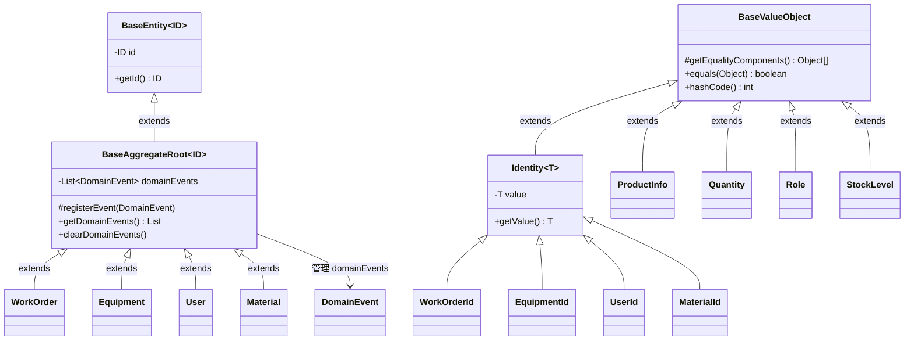

#### 核心概念

| 類別 | 用途 | 學習重點 |
|---|---|---|
| `BaseAggregateRoot<ID>` | 聚合根基類，內含 `domainEvents` 列表 | 領域事件的註冊與清除機制 |
| `BaseValueObject` | Value Object 基類，透過 `getEqualityComponents()` 實現值相等 | VO 的 equals/hashCode 由屬性值決定 |
| `Identity<T>` | 強型別 ID，避免原始型別混用 | 防止 `workOrderId` 和 `equipmentId` 互相傳錯 |
| `Specification<T>` | 規格模式，支援 `and()` / `or()` / `not()` 組合 | 將複雜業務規則抽為可組合的物件 |
| `CommandBus` / `QueryBus` | CQRS 的訊息匯流排介面 | 讀寫分離的入口點 |

#### BaseAggregateRoot 使用範例

```java
// 所有聚合根都繼承 BaseAggregateRoot，自動獲得事件管理能力
public class WorkOrder extends BaseAggregateRoot<WorkOrderId> {

    public void start() {
        // 1. 檢查業務規則（invariant）
        if (this.status != WorkOrderStatus.CREATED) {
            throw new DomainException("只有 CREATED 狀態的工單可以啟動");
        }
        // 2. 變更狀態
        this.status = WorkOrderStatus.IN_PROGRESS;
        // 3. 註冊領域事件（基類提供的方法）
        registerEvent(new WorkOrderStartedEvent(getId().getValue()));
    }
}

// 測試驗證：
@Test
void start_shouldTransitionToInProgress_andRaiseEvent() {
    WorkOrder wo = createSampleWorkOrder();
    wo.start();
    assertThat(wo.getStatus()).isEqualTo(WorkOrderStatus.IN_PROGRESS);
    assertThat(wo.getDomainEvents()).hasSize(1);
    assertThat(wo.getDomainEvents().get(0)).isInstanceOf(WorkOrderStartedEvent.class);
}
```

#### Specification 組合範例

```java
// 單一規格
Specification<WorkOrder> overdue = new OverdueWorkOrderSpec(LocalDate.now());
Specification<WorkOrder> highPriority = new HighPriorityWorkOrderSpec();

// 組合：逾期且高優先級
Specification<WorkOrder> urgentOverdue = overdue.and(highPriority);

// 組合：逾期或高優先級
Specification<WorkOrder> needsAttention = overdue.or(highPriority);

// 反轉：非高優先級
Specification<WorkOrder> normalPriority = highPriority.not();

// 使用：過濾符合條件的工單
List<WorkOrder> filtered = allOrders.stream()
    .filter(urgentOverdue::isSatisfiedBy)
    .collect(Collectors.toList());
```

---

### Module 1: Boot Basics — 工單管理

> **領域**: WorkOrder（工單）— 製造業最基礎的作業單位

#### 學習重點

- Spring Boot 2 自動配置（auto-configuration）
- `@ConfigurationProperties` 型別安全的設定綁定
- Profile 機制（`application.yml` + `application-dev.yml`）
- 建構子注入（Constructor Injection）
- `ApplicationRunner` 啟動初始化

#### DDD 模式展示

| 模式 | 實作 | 說明 |
|---|---|---|
| Aggregate Root | `WorkOrder` | 工單聚合根，包含完整狀態機（CREATED → IN_PROGRESS → COMPLETED / CANCELLED） |
| Value Object | `ProductInfo`, `Quantity`, `DateRange`, `Priority` | 自我驗證，不可變，值相等 |
| Domain Event | `WorkOrderCreatedEvent`, `WorkOrderStartedEvent` ... | 狀態變更時自動註冊事件 |
| Factory | `WorkOrderFactory` | 封裝建立邏輯，確保新建物件的一致性 |
| Repository | `WorkOrderRepository` (介面) | Domain 層定義 Port |
| Specification | `OverdueWorkOrderSpec`, `HighPriorityWorkOrderSpec` | 可組合的業務規則 |
| Domain Service | `WorkOrderDomainService` | 跨聚合的排程衝突檢查 |

#### 工單狀態機

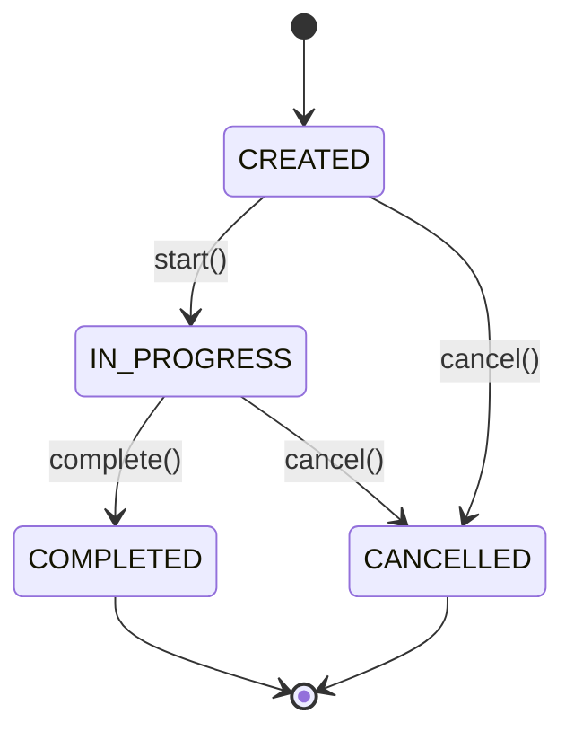

#### 六角形架構

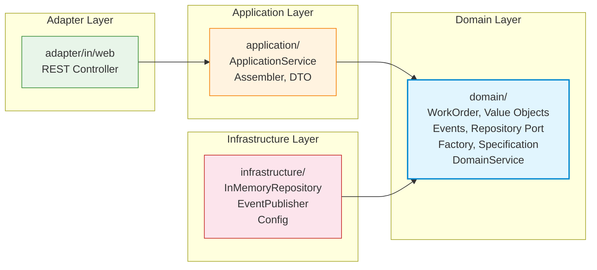

#### Quantity Value Object 範例

```java
// Value Object 自我驗證 — 建立時就確保資料正確
public class Quantity extends BaseValueObject {
    private final int planned;
    private final int defective;

    public Quantity(int planned, int defective) {
        if (planned < 0) throw new IllegalArgumentException("Planned quantity cannot be negative");
        if (defective < 0) throw new IllegalArgumentException("Defective quantity cannot be negative");
        if (defective > planned) throw new BusinessRuleViolationException("Defective cannot exceed planned");
        this.planned = planned;
        this.defective = defective;
    }

    public double getYieldRate() {
        if (planned == 0) return 0.0;
        return (planned - defective) / (double) planned;
    }
}
```

#### @ConfigurationProperties 範例

```java
// 型別安全的設定綁定 — 取代散落各處的 @Value
@ConfigurationProperties(prefix = "mes.workorder")
public class WorkOrderProperties {
    private String defaultPriority = "MEDIUM";
    private int maxActiveOrders = 100;
    // getters + setters
}

// application.yml
// mes:
//   workorder:
//     default-priority: HIGH
//     max-active-orders: 50

// 測試驗證：
@SpringBootTest(properties = {
    "mes.workorder.default-priority=HIGH",
    "mes.workorder.max-active-orders=50"
})
class WorkOrderPropertiesTest {
    @Autowired
    private WorkOrderProperties properties;

    @Test
    void shouldBindConfigurationProperties() {
        assertThat(properties.getDefaultPriority()).isEqualTo("HIGH");
        assertThat(properties.getMaxActiveOrders()).isEqualTo(50);
    }
}
```

---

### Module 2: Web API — 生產追蹤

> **領域**: ProductionRecord（生產紀錄）— 追蹤每條產線的即時生產狀況

#### 學習重點

- REST API 設計（`@RestController`、HTTP Method 語義、狀態碼）
- Bean Validation（`@Valid`、`@NotBlank`、`@Min`）
- 全域例外處理（`@RestControllerAdvice`）
- `ApiResponse<T>` 統一回應封裝
- **完整 CQRS 模式** — Command / Query 分離

#### CQRS 完整實作

本模組是 CQRS 的核心學習重點，展示讀寫完全分離的架構：

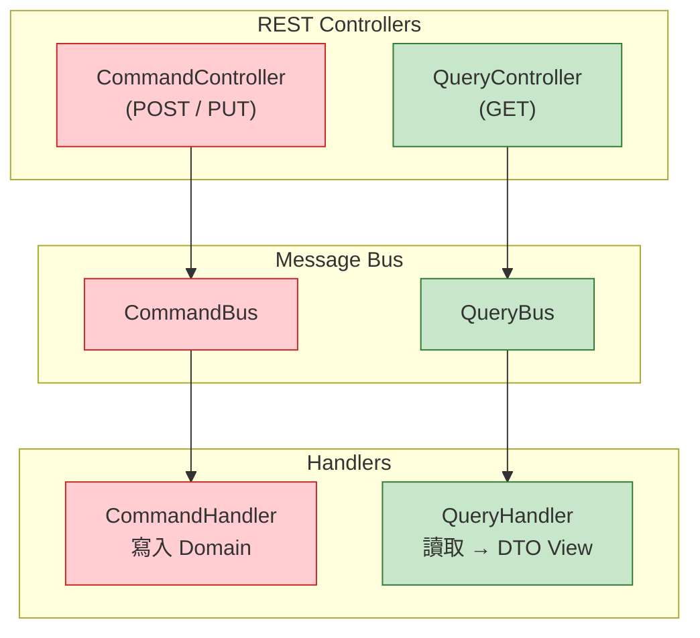

| 元件 | 寫入端（Command） | 讀取端（Query） |
|---|---|---|
| Controller | `ProductionCommandController` (POST/PUT) | `ProductionQueryController` (GET) |
| 匯流排 | `SimpleCommandBus` | `SimpleQueryBus` |
| 訊息物件 | `StartProductionCommand`, `RecordOutputCommand` ... | `GetProductionRecordQuery`, `ListProductionByLineQuery` ... |
| Handler | `StartProductionCommandHandler` ... | `GetProductionRecordQueryHandler` ... |
| 回傳型別 | void / ID | `ProductionRecordView`, `ProductionSummaryView` |

#### SimpleCommandBus 路由機制

```java
// CommandBus 是一個 Mediator，自動將 Command 路由到對應的 Handler
@Component
public class SimpleCommandBus implements CommandBus {

    private final Map<Class, CommandHandler> handlerMap = new HashMap<>();

    // Spring 自動注入所有 CommandHandler Bean
    public SimpleCommandBus(List<CommandHandler> handlers) {
        for (CommandHandler handler : handlers) {
            handlerMap.put(handler.getCommandType(), handler);
        }
    }

    @Override
    public <C extends Command, R> R dispatch(C command) {
        CommandHandler handler = handlerMap.get(command.getClass());
        if (handler == null) {
            throw new IllegalArgumentException("找不到 Handler: " + command.getClass().getSimpleName());
        }
        return (R) handler.handle(command);
    }
}

// 新增功能時的開放封閉原則（OCP）：
// 1. 建立 PauseProductionCommand implements Command
// 2. 建立 PauseProductionCommandHandler implements CommandHandler
// 3. 完成！不需修改 SimpleCommandBus 或任何現有 Handler
```

#### REST API 端點

```
POST   /api/v1/productions              開始生產
PUT    /api/v1/productions/{id}/output   記錄產出
PUT    /api/v1/productions/{id}/pause    暫停生產
PUT    /api/v1/productions/{id}/complete 完成生產
GET    /api/v1/productions/{id}          查詢單筆
GET    /api/v1/productions?lineId=&status=  依產線查詢
GET    /api/v1/productions/summary?lineId=  產線摘要
```

#### curl 測試範例

```bash
# 開始生產
curl -X POST http://localhost:8081/api/v1/productions \
  -H "Content-Type: application/json" \
  -d '{"workOrderId":"WO-001","lineId":"LINE-A","productCode":"PCB-001","operatorId":"OP-001","operatorName":"王大明"}'

# 記錄產出
curl -X PUT http://localhost:8081/api/v1/productions/PR-001/output \
  -H "Content-Type: application/json" \
  -d '{"goodQuantity":95,"defectiveQuantity":3,"reworkQuantity":2}'

# 查詢
curl http://localhost:8081/api/v1/productions/PR-001
```

#### 統一回應格式

```json
{
  "code": 200,
  "message": "Success",
  "data": {
    "id": "PR-001",
    "status": "RUNNING",
    "lineId": "LINE-A",
    "goodQuantity": 95,
    "defectiveQuantity": 3
  },
  "timestamp": "2024-01-15T10:30:00"
}
```

#### 全域例外處理對照

| Exception | HTTP Status | 場景 |
|---|---|---|
| `EntityNotFoundException` | 404 Not Found | 查詢不存在的資源 |
| `MethodArgumentNotValidException` | 400 Bad Request | `@Valid` 驗證失敗 |
| `DomainException` | 422 Unprocessable Entity | 領域規則違反 |
| `BusinessRuleViolationException` | 409 Conflict | 業務規則衝突 |

---

### Module 3: MyBatis — 設備管理

> **領域**: Equipment（設備）含 MaintenanceRecord（保養紀錄）— 展示聚合根內包含子 Entity

#### 學習重點

- MyBatis XML Mapper + Annotation 混合使用
- Data Object（DO）與 Domain Model 的轉換
- **Repository Adapter 模式** — Domain Port → MyBatis 實作的橋接
- H2 記憶體資料庫 + `schema.sql` / `data.sql` 自動初始化
- **CQRS 讀取路徑優化** — Query Handler 繞過 Domain Model，直接用 Mapper 查詢

#### 設備狀態機

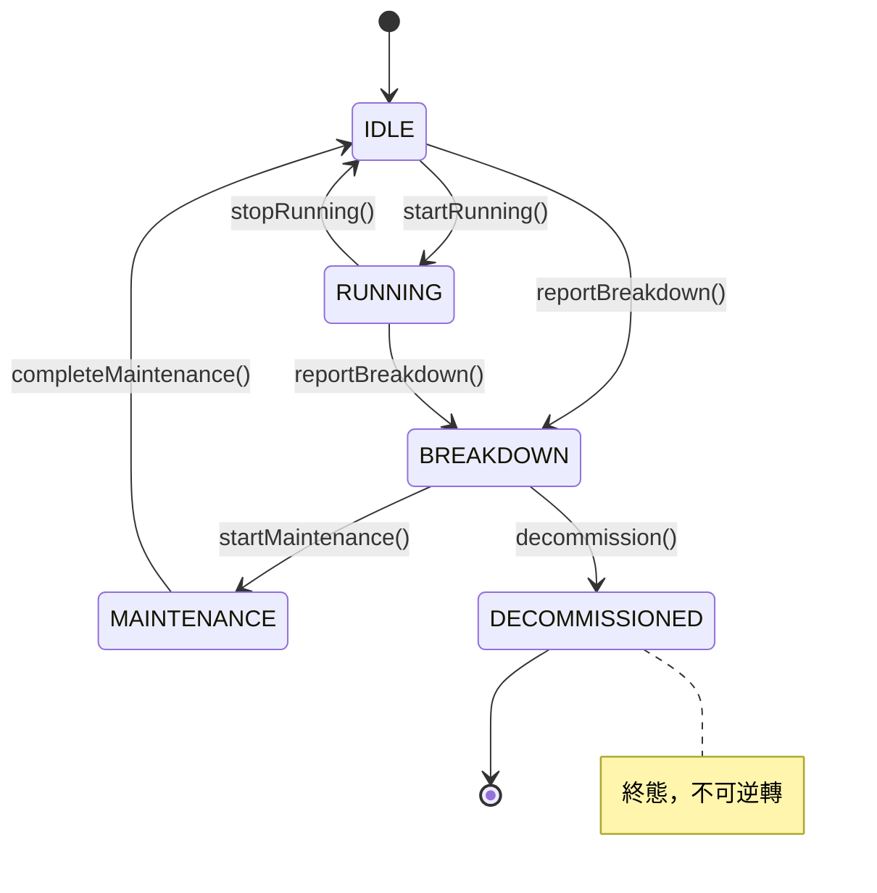

#### 持久層架構

這是本模組最重要的教學重點 — 如何在六角形架構中整合 MyBatis：

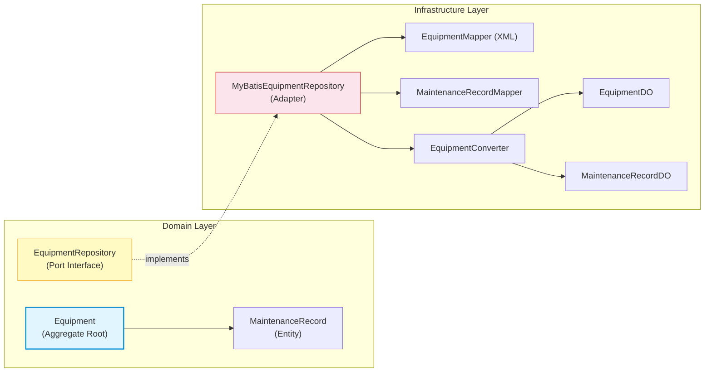

#### 為什麼需要 DO（Data Object）？

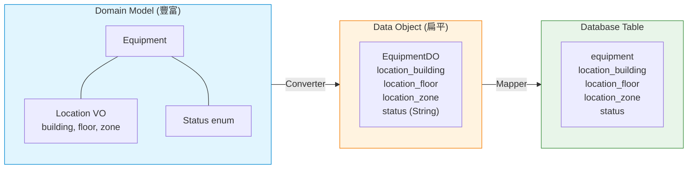

- **Domain Model** 有行為和 VO → 領域邏輯的「家」
- **Data Object** 是純 POJO，欄位攤平 → MyBatis 的「橋」
- **Database Table** 只有扁平欄位 → 持久化的「終點」

#### CQRS 讀寫分離 — Query 繞過 Domain Model

```java
// 寫入路徑（完整 Domain Model）：
//   Command → Handler → Repository.save(aggregate) → Mapper.insert(DO)
//   需要重建完整聚合根，確保業務規則

// 讀取路徑（繞過 Domain Model）：
//   Query → Handler → Mapper.selectByStatus() → DTO View
//   省去 DO → Domain Model → DTO 的雙重轉換，效能更好

@Component
public class ListEquipmentByStatusQueryHandler
        implements QueryHandler<ListEquipmentByStatusQuery, List<EquipmentSummaryView>> {

    private final EquipmentMapper equipmentMapper; // 直接注入 Mapper，不經過 Repository

    @Override
    public List<EquipmentSummaryView> handle(ListEquipmentByStatusQuery query) {
        List<EquipmentDO> results = equipmentMapper.selectByStatus(query.getStatus());
        return results.stream().map(this::toView).collect(Collectors.toList());
    }
}
```

#### DDD Repository Pattern 實作

本模組展示 **DDD Repository Pattern** 的完整實作，這是 DDD 戰術設計中連接領域層與基礎設施層的核心模式。

##### 核心原則

| 原則 | 說明 |
|------|------|
| **Repository 只操作聚合根** | 所有寫入操作都必須透過聚合根，確保業務一致性 |
| **Domain Layer 定義介面** | Repository 介面在 Domain 層定義（Port），基礎設施層實作（Adapter） |
| **聚合根維護不變式** | 所有對聚合內實體的修改都必須經過聚合根的業務方法 |

##### 為什麼只操作聚合根？

```java
// ❌ 錯誤：不透過聚合根直接操作內部 Entity
maintenanceRecordRepository.save(record);  // 繞過聚合根，業務規則失效

// ✅ 正確：透過聚合根操作
equipment.addMaintenanceRecord(...);        // 聚合根會驗證業務規則
equipmentRepository.save(equipment);       // Repository 只接受聚合根
```

##### Repository 介面（Domain Layer — Port）

```java
// 領域層定義的 Repository 介面 — 只知道聚合根，不知道 MyBatis
public interface EquipmentRepository extends Repository<Equipment, EquipmentId> {
    Optional<Equipment> findById(EquipmentId id);
    List<Equipment> findAll();
    void save(Equipment aggregate);  // 參數是聚合根
    void deleteById(EquipmentId id);
    
    // 自訂查詢方法
    List<Equipment> findByStatus(EquipmentStatus status);
    List<Equipment> findByType(EquipmentType type);
}
```

##### Repository 實作（Infrastructure Layer — Adapter）

```java
@Repository
public class MyBatisEquipmentRepository implements EquipmentRepository {

    @Override
    @Transactional
    public void save(Equipment aggregate) {
        // 1. 保存聚合根（Equipment）
        EquipmentDO equipmentDO = converter.toDataObject(aggregate);
        equipmentMapper.insertOrUpdate(equipmentDO);
        
        // 2. 同步維護聚合內的子 Entity（MaintenanceRecord）
        //    確保聚合根與其內部實體的一致性
        syncMaintenanceRecords(aggregate);
        
        // 3. 清除領域事件
        aggregate.clearEvents();
    }

    // 同步維護記錄：比較記憶體與資料庫，執行增/刪/改
    private void syncMaintenanceRecords(Equipment aggregate) {
        String equipmentId = aggregate.getId().getValue();
        List<MaintenanceRecordDO> existing = maintenanceRecordMapper.selectByEquipmentId(equipmentId);
        Set<String> existingIds = existing.stream().map(MaintenanceRecordDO::getId).collect(toSet());
        
        Set<String> currentIds = aggregate.getMaintenanceRecords().stream()
            .map(r -> r.getId().getValue()).collect(toSet());

        // INSERT / UPDATE 聚合中的記錄
        for (MaintenanceRecord record : aggregate.getMaintenanceRecords()) {
            MaintenanceRecordDO recordDO = converter.maintenanceRecordToDO(record, equipmentId);
            if (existingIds.contains(record.getId().getValue())) {
                maintenanceRecordMapper.update(recordDO);
            } else {
                maintenanceRecordMapper.insert(recordDO);
            }
        }
    }
}
```

##### 測試驗證

```java
@SpringBootTest
@Transactional
class MyBatisEquipmentRepositoryTest {

    @Autowired
    private EquipmentRepository equipmentRepository;

    @Test
    void shouldSaveAndFindWithMaintenanceRecords() {
        // 建立聚合根（包含子 Entity）
        Equipment equipment = createTestEquipment();
        equipment.scheduleMaintenance("定期保養", LocalDate.now().plusDays(7));

        // 透過 Repository 保存（聚合根 + 子 Entity 一起持久化）
        equipmentRepository.save(equipment);

        // 驗證可以完整取出
        Optional<Equipment> found = equipmentRepository.findById(equipment.getId());
        assertThat(found).isPresent();
        assertThat(found.get().getMaintenanceRecords()).hasSize(1);
    }
}
```

##### 六角形架構視角

```
┌─────────────────────────────────────────────────────────────┐
│                      Application Layer                      │
│                  (ApplicationService / CommandHandler)       │
└────────────────────────────┬────────────────────────────────┘
                             │ save(Equipment)
                             ▼
┌─────────────────────────────────────────────────────────────┐
│                        Domain Layer                         │
│  ┌─────────────────┐    ┌─────────────────────────────────┐ │
│  │ Equipment       │    │ EquipmentRepository (Port)      │ │
│  │ (Aggregate Root)│    │ ← 領域層定義，只接受聚合根       │ │
│  │                 │    └─────────────────────────────────┘ │
│  │ MaintenanceRecord│                                        │
│  │ (Entity)        │                                        │
│  └─────────────────┘                                        │
└────────────────────────────┬────────────────────────────────┘
                             │ implements
                             ▼
┌─────────────────────────────────────────────────────────────┐
│                    Infrastructure Layer                     │
│  ┌─────────────────────────────────────────────────────────┐│
│  │ MyBatisEquipmentRepository (Adapter)                    ││
│  │ ← 實作 Domain 定義的介面，負責持久化                     ││
│  └─────────────────────────────────────────────────────────┘│
│         │                    │                    │         │
│         ▼                    ▼                    ▼         │
│  ┌───────────┐      ┌───────────────┐      ┌───────────┐   │
│  │EquipmentMapper│   │MaintenanceRecord│    │Converter │   │
│  │   (XML)     │      │   Mapper       │      │           │   │
│  └───────────┘      └───────────────┘      └───────────┘   │
└─────────────────────────────────────────────────────────────┘
```

##### 測試結果

```
[INFO] Tests run: 9, Failures: 0, Errors: 0, Skipped: 0
[INFO] BUILD SUCCESS
```

#### H2 Console

啟動後可透過 `http://localhost:8082/h2-console` 查看資料庫。

| 設定 | 值 |
|---|---|
| JDBC URL | `jdbc:h2:mem:testdb` |
| User | `sa` |
| Password | （空白） |

---

### Module 4: Kafka — 品質檢驗

> **領域**: InspectionOrder（品檢單）含 InspectionResult（檢驗結果）— 展示事件驅動架構與跨 Bounded Context 整合

#### 學習重點

- Spring Cloud Stream + Kafka Binder
- `StreamBridge` 發送訊息
- `Consumer<Message<T>>` 接收訊息
- Domain Event 序列化 / 反序列化（Jackson）
- **跨 Bounded Context 的事件驅動整合**

#### 事件驅動架構

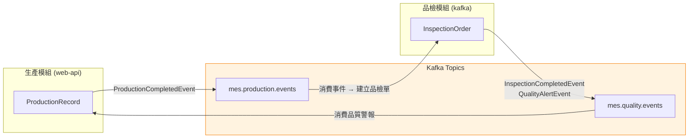

**工作流程**：
1. 生產模組完成生產 → 發送 `ProductionCompletedEvent`
2. 品檢模組收到事件 → 自動建立最終品檢單
3. 品檢完成後 → 發送 `InspectionCompletedEvent`
4. 若不良率超標 → 額外發送 `QualityAlertEvent`

#### Spring Cloud Stream 綁定

| 通道 | Topic | 方向 | 用途 |
|---|---|---|---|
| `qualityEventsOut-out-0` | `mes.quality.events` | 發送 | 品檢完成、品質警報 |
| `qualityEventsIn-in-0` | `mes.quality.events` | 接收 | 消費品質事件 |
| `productionEventsIn-in-0` | `mes.production.events` | 接收 | 生產完成時自動建立品檢單 |

#### StreamBridge 發送範例

```java
// Domain Event → Kafka Message
@Component
public class KafkaDomainEventPublisher implements DomainEventPublisher {

    private final StreamBridge streamBridge;

    @Override
    public void publish(DomainEvent event) {
        Message<DomainEvent> message = MessageBuilder
            .withPayload(event)
            .setHeader("eventType", event.getClass().getSimpleName())
            .setHeader("aggregateId", event.getAggregateId())
            .build();
        streamBridge.send("qualityEventsOut-out-0", message);
    }
}
```

#### 跨 Context 事件消費

```java
// 當生產模組發出 ProductionCompletedEvent 時，品檢模組自動建立最終檢驗單
@Bean
public Consumer<Message<String>> productionEventsIn() {
    return message -> {
        ProductionCompletedPayload payload = objectMapper.readValue(
            message.getPayload(), ProductionCompletedPayload.class);

        CreateInspectionCommand command = new CreateInspectionCommand(
            payload.getWorkOrderId(), payload.getProductCode(), "FINAL");
        commandBus.dispatch(command);
    };
}
```

#### 品質 Domain Service — SPC 簡化規則

```java
// 統計製程控制（SPC）— 連續 7 點同側規則
// 若連續 7 個量測值都在平均值的同一側，表示製程可能失控
public boolean isWithinSPC(List<MeasuredValue> values, QualityStandard standard) {
    double mean = standard.getMean();
    int sameSideCount = 0;
    Boolean lastSide = null;

    for (MeasuredValue v : values) {
        boolean aboveMean = v.getValue() > mean;
        if (lastSide != null && lastSide == aboveMean) {
            sameSideCount++;
            if (sameSideCount >= 7) return false; // 製程失控
        } else {
            sameSideCount = 1;
        }
        lastSide = aboveMean;
    }
    return true;
}
```

---

### Module 5: Security — 使用者認證與授權

> **領域**: User（使用者）含 Role（角色）、Permission（權限）— 展示 Spring Security + JWT + RBAC

#### 學習重點

- `SecurityFilterChain` bean（現代做法，非已棄用的 `WebSecurityConfigurerAdapter`）
- OAuth2 Resource Server + JWT 驗證
- `@PreAuthorize` 方法級安全控制
- RBAC（Role-Based Access Control）角色權限模型
- `UserDetailsService` 自訂實作
- `BCryptPasswordEncoder` 密碼加密
- 六角形架構中的安全層整合

#### Spring Security 請求處理流程

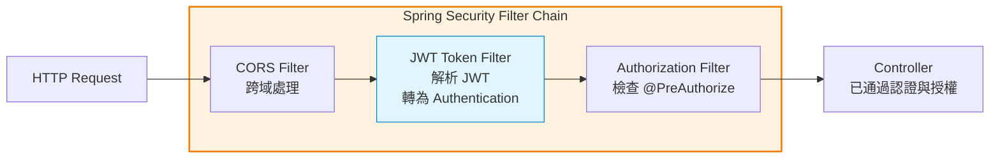

#### RBAC 權限模型

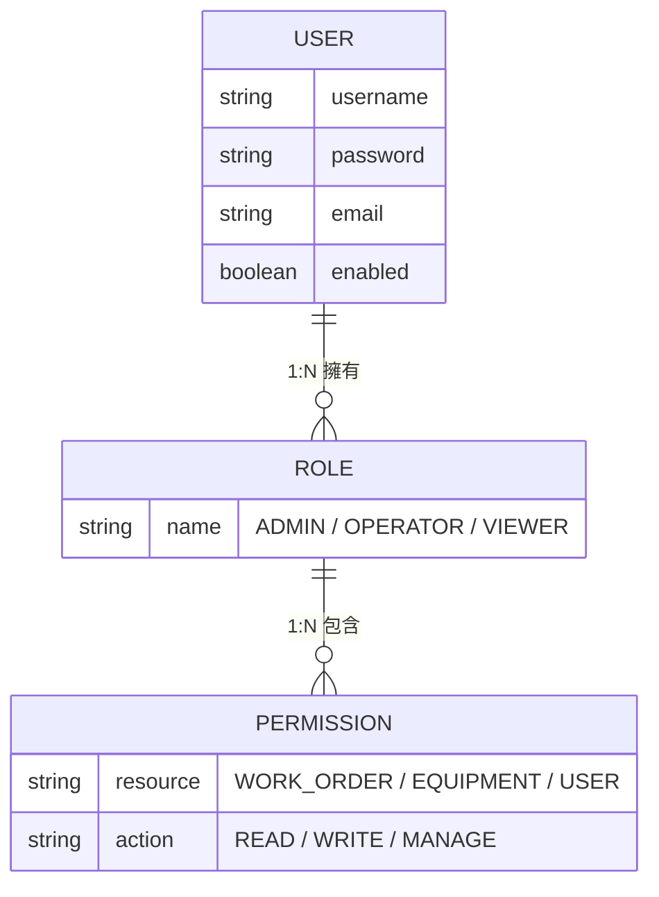

**範例**：

| User | Role | Permissions |
|---|---|---|
| admin | ROLE_ADMIN | WORK_ORDER:READ, WORK_ORDER:WRITE, EQUIPMENT:READ, USER:MANAGE |
| operator | ROLE_OPERATOR | WORK_ORDER:READ, WORK_ORDER:WRITE |
| viewer | ROLE_VIEWER | WORK_ORDER:READ |

#### SecurityFilterChain 設定範例

```java
// 現代做法：使用 @Bean SecurityFilterChain（非已棄用的 extends WebSecurityConfigurerAdapter）
@Configuration
@EnableWebSecurity
@EnableMethodSecurity  // 啟用 @PreAuthorize
public class SecurityConfig {

    @Bean
    public SecurityFilterChain securityFilterChain(HttpSecurity http) throws Exception {
        http
            .csrf().disable()                        // JWT 不需 CSRF
            .sessionManagement()
                .sessionCreationPolicy(STATELESS)    // 無狀態，每次靠 JWT
            .and()
            .authorizeHttpRequests()
                .antMatchers("/api/v1/auth/**").permitAll()  // 登入/註冊公開
                .anyRequest().authenticated()                 // 其餘需認證
            .and()
            .oauth2ResourceServer()
                .jwt()                                        // JWT 驗證
                .jwtAuthenticationConverter(jwtAuthConverter());
        return http.build();
    }
}
```

#### JWT Token 結構

```
Header:  { "alg": "HS256", "typ": "JWT" }
Payload: {
  "sub": "admin",           ← 使用者名稱
  "roles": ["ROLE_ADMIN"],  ← 角色（對應 GrantedAuthority）
  "iat": 1705298400,        ← 簽發時間
  "exp": 1705302000         ← 過期時間（1 小時）
}
Signature: HMAC-SHA256(header + payload, secretKey)
```

#### curl 測試範例

```bash
# 1. 註冊使用者
curl -X POST http://localhost:8084/api/v1/auth/register \
  -H "Content-Type: application/json" \
  -d '{"username":"admin","password":"password123","email":"admin@mes.com","roleNames":["ADMIN"]}'

# 2. 登入取得 JWT
TOKEN=$(curl -s -X POST http://localhost:8084/api/v1/auth/login \
  -H "Content-Type: application/json" \
  -d '{"username":"admin","password":"password123"}' | jq -r '.data.token')

# 3. 攜帶 JWT 存取受保護的 API
curl http://localhost:8084/api/v1/users/me \
  -H "Authorization: Bearer $TOKEN"

# 4. 沒有 JWT → 401 Unauthorized
curl http://localhost:8084/api/v1/users/me
# → {"code": 401, "message": "未提供有效的認證資訊"}

# 5. 權限不足 → 403 Forbidden（用 VIEWER 角色存取 ADMIN 端點）
curl -X PUT http://localhost:8084/api/v1/users/123/lock \
  -H "Authorization: Bearer $VIEWER_TOKEN"
# → {"code": 403, "message": "權限不足"}
```

#### REST API 端點

```
POST   /api/v1/auth/register                   註冊（公開）
POST   /api/v1/auth/login                      登入取得 JWT（公開）
GET    /api/v1/users/{id}                       查詢使用者（ADMIN, OPERATOR）
GET    /api/v1/users?role=                      依角色查詢（ADMIN, OPERATOR）
PUT    /api/v1/users/{id}/role                  指派角色（ADMIN only）
PUT    /api/v1/users/{id}/password              修改密碼（本人 or ADMIN）
PUT    /api/v1/users/{id}/lock                  鎖定帳號（ADMIN only）
```

---

### Module 6: Gateway — API 閘道與服務聚合

> **領域**: API 路由與服務聚合 — 展示 Spring Cloud Gateway 作為微服務入口

#### 學習重點

- Spring Cloud Gateway（WebFlux 響應式）
- Route 路由設定（Java DSL + YAML）
- Predicate（路徑、方法、Header 匹配）
- Filter（全域過濾器、自訂過濾器工廠）
- Resilience4j 斷路器（Circuit Breaker）+ Fallback
- **WebClient vs OpenFeign** 比較
- Rate Limiting（速率限制）

#### 閘道路由總覽

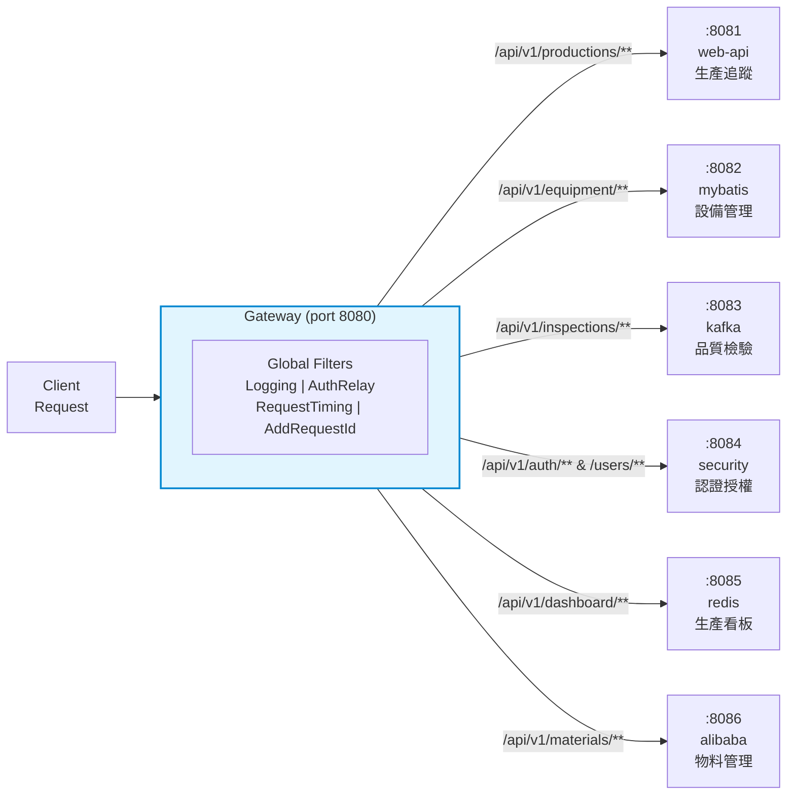

#### Gateway Filter 執行順序

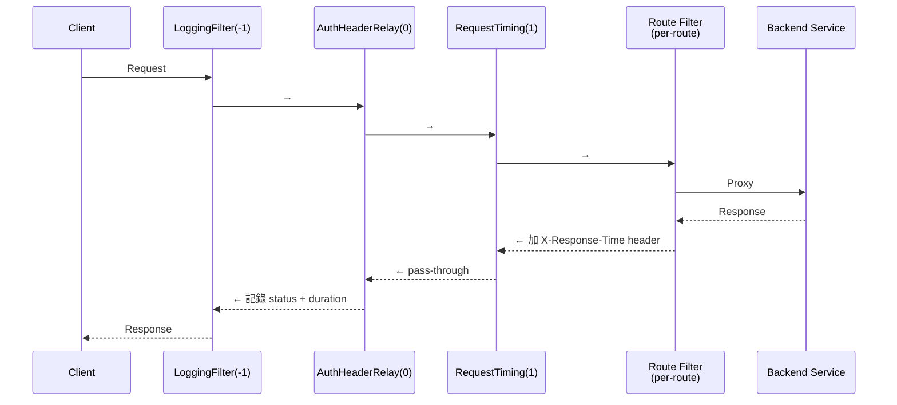

#### 斷路器狀態機（Resilience4j）

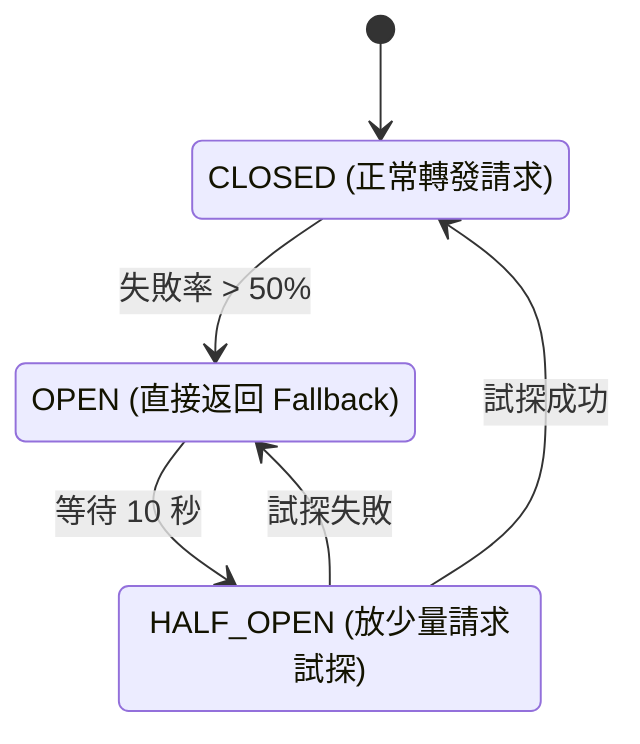

#### WebClient vs OpenFeign 比較

| 特性 | WebClient (本模組使用) | OpenFeign (參考範例) |
|---|---|---|
| 程式模型 | 響應式（Reactive） | 命令式（Blocking） |
| 相容性 | WebFlux / WebMVC 皆可 | 僅 WebMVC |
| 呼叫方式 | `Mono<T>` / `Flux<T>` | 同步方法呼叫 |
| 適用場景 | Gateway、高併發 | 傳統微服務間呼叫 |
| 宣告方式 | 程式碼建構 | 介面 + 註解 |

```java
// WebClient（響應式）— Gateway 內使用
Mono<String> result = webClient.get()
    .uri("http://localhost:8081/api/v1/productions/{id}", id)
    .retrieve()
    .bodyToMono(String.class);

// OpenFeign（宣告式）— 僅作參考，用於 WebMVC 微服務
// @FeignClient(name = "production-service", url = "http://localhost:8081")
// public interface ProductionFeignClient {
//     @GetMapping("/api/v1/productions/{id}")
//     ProductionView getProduction(@PathVariable String id);
// }
```

#### 服務聚合範例（WebClient + Mono.zip）

```java
// 並行呼叫多個後端服務，聚合成單一回應
public Mono<AggregatedDashboardView> aggregateDashboard() {
    Mono<Map> production = webClient.get()
        .uri("http://localhost:8081/api/v1/productions/summary")
        .retrieve().bodyToMono(Map.class);

    Mono<Map> equipment = webClient.get()
        .uri("http://localhost:8082/api/v1/equipment?status=RUNNING")
        .retrieve().bodyToMono(Map.class);

    // Mono.zip 並行執行，兩個都完成後合併
    return Mono.zip(production, equipment)
        .map(tuple -> new AggregatedDashboardView(tuple.getT1(), tuple.getT2()));
}
```

---

### Module 7: Redis — 快取與即時數據

> **領域**: DashboardMetrics（生產看板）— 展示 Redis 作為快取層與 CQRS 讀取模型

#### 學習重點

- Spring Data Redis + Lettuce 客戶端
- `RedisTemplate<String, Object>` 五種資料型別操作
- Spring Cache 抽象（`@Cacheable`、`@CacheEvict`、`@CachePut`）
- 自訂 Serializer（Jackson2JsonRedisSerializer）
- **Cache-aside 模式** — 先查快取，miss 再查資料庫
- **CachePort** 六角形抽象 — Domain 定義快取介面，Redis 實作

#### 快取策略比較

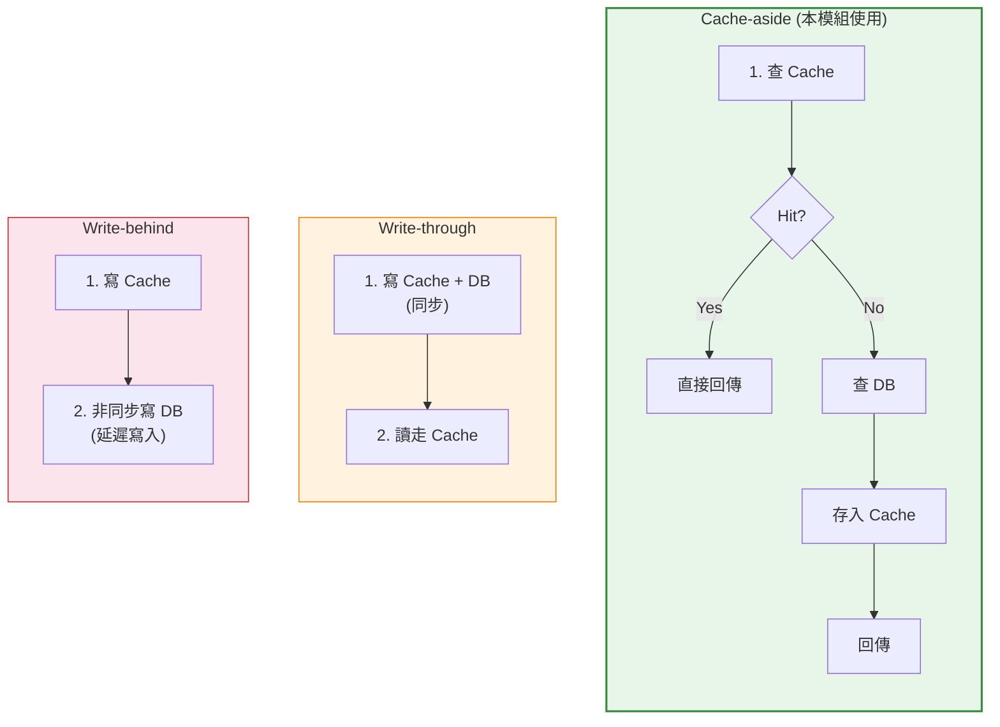

| 策略 | 優點 | 缺點 |
|---|---|---|
| **Cache-aside** (本模組) | 讀多寫少最佳 | 首次 Miss 慢 |
| **Write-through** | 資料一致性高 | 寫入慢（雙寫） |
| **Write-behind** | 寫入效能最高 | 可能丟資料 |

#### CachePort — 六角形快取抽象

```java
// Domain 層定義的快取介面（Port）— 不知道 Redis 的存在
public interface CachePort {
    <T> void put(String key, T value, long ttlSeconds);
    <T> T get(String key, Class<T> type);
    void evict(String key);
    void evictByPattern(String pattern);
    boolean exists(String key);
}

// Infrastructure 層的 Redis 實作（Adapter）
@Component
public class RedisCacheAdapter implements CachePort {
    private final RedisTemplate<String, Object> redisTemplate;

    @Override
    public <T> void put(String key, T value, long ttlSeconds) {
        redisTemplate.opsForValue().set(key, value, ttlSeconds, TimeUnit.SECONDS);
    }

    @Override
    public <T> T get(String key, Class<T> type) {
        Object value = redisTemplate.opsForValue().get(key);
        return type.cast(value);
    }
}
```

#### Redis 五種資料型別與應用場景

```java
// String — 最常用，快取單一物件
redisTemplate.opsForValue().set("dashboard:LINE-A", dashboardJson, 30, TimeUnit.MINUTES);

// Hash — 結構化資料，部分更新
redisTemplate.opsForHash().put("equipment:EQ-001", "status", "RUNNING");
redisTemplate.opsForHash().put("equipment:EQ-001", "temperature", "85.5");

// List — 有序列表，生產日誌
redisTemplate.opsForList().rightPush("production-log:LINE-A", logEntry);

// Set — 無序集合，在線設備集
redisTemplate.opsForSet().add("online-equipment", "EQ-001", "EQ-002");

// ZSet — 有序集合，排行榜
redisTemplate.opsForZSet().add("yield-ranking", "LINE-A", 0.95);
redisTemplate.opsForZSet().add("yield-ranking", "LINE-B", 0.88);
```

#### Spring Cache 註解範例

```java
@Service
public class DashboardCacheService {

    // 自動快取：相同 lineId 第二次呼叫直接從快取回傳
    @Cacheable(value = "dashboard", key = "#lineId")
    public DashboardView getDashboard(String lineId) {
        // 此方法只在 cache miss 時執行
        return loadFromRepository(lineId);
    }

    // 更新快取：方法執行後將結果存入快取
    @CachePut(value = "dashboard", key = "#lineId")
    public DashboardView updateDashboard(String lineId, DashboardView view) {
        return view;
    }

    // 清除快取：刪除指定 key
    @CacheEvict(value = "dashboard", key = "#lineId")
    public void evictDashboard(String lineId) { }

    // 清除整個 cache name 下所有資料
    @CacheEvict(value = "dashboard", allEntries = true)
    public void evictAllDashboards() { }
}
```

#### Cache-aside 實作範例

```java
// CQRS 讀取端 — 先查快取再查 Repository
@Component
public class GetDashboardQueryHandler implements QueryHandler<GetDashboardQuery, DashboardView> {

    private final CachePort cachePort;
    private final DashboardMetricsRepository repository;

    @Override
    public DashboardView handle(GetDashboardQuery query) {
        String cacheKey = "dashboard:" + query.getLineId();

        // 1. 先查 Cache
        DashboardView cached = cachePort.get(cacheKey, DashboardView.class);
        if (cached != null) {
            return cached;  // Cache Hit — 直接回傳
        }

        // 2. Cache Miss — 查 Repository
        DashboardMetrics metrics = repository.findLatestByLineId(query.getLineId())
            .orElseThrow(() -> new EntityNotFoundException("Dashboard not found"));

        // 3. 轉換並存入 Cache
        DashboardView view = DashboardAssembler.toView(metrics);
        cachePort.put(cacheKey, view, 1800);  // TTL 30 分鐘
        return view;
    }
}
```

#### REST API 端點

```
POST   /api/v1/dashboard/update                 更新看板數據
PUT    /api/v1/dashboard/{lineId}/equipment      更新設備狀態
DELETE /api/v1/dashboard/cache/{key}             手動清除快取
GET    /api/v1/dashboard/{lineId}                查詢單一產線看板
GET    /api/v1/dashboard/overview                 全產線總覽
```

---

### Module 8: Cloud Alibaba — 微服務治理

> **領域**: Material（物料）— 展示 Nacos 服務發現/配置中心與 Sentinel 流量控制

#### 學習重點

- **Nacos Discovery** — 服務註冊與發現
- **Nacos Config** — 配置中心（動態配置刷新）
- **Sentinel** — 流量控制（QPS 限流、執行緒數限流）
- **Sentinel** — 斷路器（熔斷降級）
- `@SentinelResource` — fallback vs blockHandler 的區別
- `bootstrap.yml` vs `application.yml` 載入順序
- `@RefreshScope` 動態配置

#### Nacos 架構

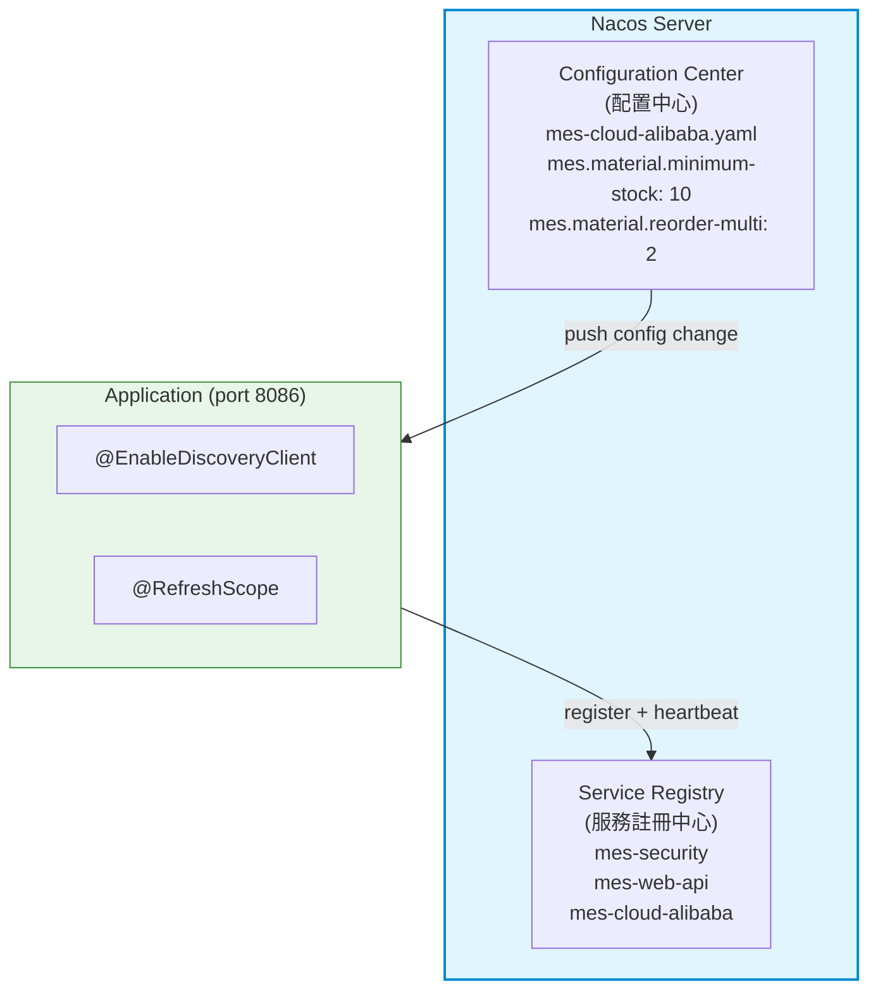

#### bootstrap.yml vs application.yml

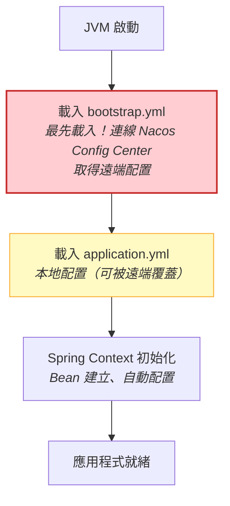

| 檔案 | 放什麼？ |
|---|---|
| **bootstrap.yml** | Nacos Config 連線資訊（server-addr, namespace, group）、應用程式名稱（Data ID） |
| **application.yml** | 業務配置（port, logging）、Nacos Discovery 連線、Sentinel 配置 |

#### @RefreshScope 動態配置

```java
@Component
@RefreshScope  // Nacos 推送新配置時，此 Bean 會被重建
public class NacosConfigListener {

    @Value("${mes.material.minimum-stock-threshold:10}")
    private int minimumStockThreshold;

    // 當 Nacos 上的配置修改後，此值自動更新
    // 不需重啟應用！

    public int getMinimumStockThreshold() {
        return minimumStockThreshold;
    }
}
```

#### Sentinel 流控規則

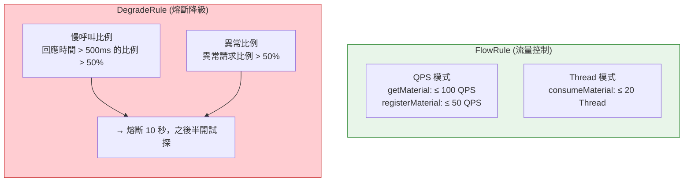

#### @SentinelResource — fallback vs blockHandler

```java
@Service
public class MaterialApplicationService {

    // fallback: 處理「業務異常」（方法本身拋出的 Exception）
    // blockHandler: 處理「流控異常」（Sentinel 拒絕請求時的 BlockException）
    @SentinelResource(
        value = "getMaterial",
        fallback = "getMaterialFallback",          // 業務降級
        blockHandler = "getMaterialBlockHandler"    // 流控降級
    )
    public MaterialView getMaterial(String materialId) {
        return queryBus.dispatch(new GetMaterialQuery(materialId));
    }

    // 業務異常降級 — 簽名相同 + 多一個 Throwable 參數
    public MaterialView getMaterialFallback(String materialId, Throwable ex) {
        log.warn("getMaterial 業務異常，返回預設值: {}", ex.getMessage());
        return MaterialView.empty(materialId);
    }

    // 流控降級 — 簽名相同 + 多一個 BlockException 參數
    public MaterialView getMaterialBlockHandler(String materialId, BlockException ex) {
        log.warn("getMaterial 被流控限制: {}", ex.getClass().getSimpleName());
        throw new BusinessRuleViolationException("系統忙碌中，請稍後重試");
    }
}
```

#### 物料管理狀態流

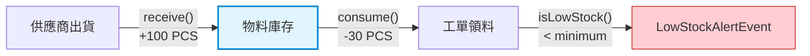

#### REST API 端點

```
POST   /api/v1/materials                         註冊新物料
PUT    /api/v1/materials/{id}/receive             入庫（增加庫存）
PUT    /api/v1/materials/{id}/consume             領料（消耗庫存）
GET    /api/v1/materials/{id}                     查詢單一物料
GET    /api/v1/materials?type=RAW_MATERIAL        依類型查詢
GET    /api/v1/materials/low-stock                 低庫存警報清單
GET    /api/v1/health                              健康檢查（Nacos 用）
```

## 額外學習主題

除了上述 8 個模組，以下主題可進一步擴展 Spring Boot 技能：

| 主題 | 用途 | 建議學習資源 |
|---|---|---|
| **Spring Boot Actuator** | 生產環境監控、健康檢查、Metrics | `/actuator/health`, `/actuator/metrics`, `/actuator/info` |
| **Spring Boot Admin** | 集中化管理多個微服務 | Spring Boot Admin Server + Client |
| **Spring Boot AOP** | 切面編程、日誌、效能監控、權限檢查 | `@Aspect`, `@Before`, `@After`, `@Around` |
| **Spring Boot Validation** | 請求參數校驗 | `@Valid`, `@Validated`, 自訂 Validator |
| **Spring Boot Testing** | 單元測試、整合測試、切片測試 | JUnit 5, AssertJ, MockMvc, TestContainers |
| **Spring Boot WebFlux** | 響應式編程、高併發處理 | Mono, Flux, WebClient, R2DBC |
| **Spring Boot WebSocket** | 即時雙向通訊 | STOMP, WebSocket Handler |
| **Spring Boot GraphQL** | GraphQL API | GraphQL Java Tools, `@SchemaMapping` |
| **Spring Boot OpenAPI/Swagger** | API 文件自動生成 | springdoc-openapi, Swagger UI |
| **Spring Boot HATEOAS** | REST API 超媒體支援 | EntityModel, Link, RepresentationModel |
| **Spring Boot Session** | 分散式 Session 管理 | Redis Session, Spring Session |

### Actuator 端點範例

```java
// 啟用所有 actuator 端點
management.endpoints.web.exposure.include=*
management.endpoint.health.show-details=always

// 常見端點
GET /actuator/health          # 健康檢查
GET /actuator/info            # 應用資訊
GET /actuator/metrics         # 效能指標
GET /actuator/env             # 環境變數
GET /actuator/beans           # Bean 清單
GET /actuator/threaddump      # 執行緒狀態
POST /actuator/refresh        # 重新載入配置
```

### AOP 範例

```java
@Aspect
@Component
public class PerformanceAspect {

    @Around("@annotation(PerfMonitor)")
    public Object measureTime(ProceedingJoinPoint pjp) throws Throwable {
        long start = System.currentTimeMillis();
        Object result = pjp.proceed();
        long duration = System.currentTimeMillis() - start;
        log.info("{} 執行時間: {}ms", pjp.getSignature(), duration);
        return result;
    }
}

// 使用
@PerfMonitor
public void processOrder(Order order) { ... }
```

### 測試角度學習這些主題

> **重要原則**：所有測試都是最好的學習資源。從測試理解行為，從測試驗證功能。

---

### 1. Actuator — 從測試理解健康檢查

```java
// 測試：驗證 Actuator 健康檢查端點
@SpringBootTest(webEnvironment = SpringBootTest.WebEnvironment.RANDOM_PORT)
class ActuatorHealthTest {

    @Autowired
    private TestRestTemplate restTemplate;

    @Test
    @DisplayName("健康檢查應回傳 UP 狀態")
    void health_shouldReturnUp() {
        ResponseEntity<Map> response = restTemplate.getForEntity("/actuator/health", Map.class);
        
        assertThat(response.getStatusCode()).isEqualTo(HttpStatus.OK);
        assertThat(response.getBody()).containsKey("status");
        assertThat(response.getBody().get("status")).isEqualTo("UP");
    }

    @Test
    @DisplayName("自訂健康指標 — 檢查資料庫連線")
    void health_withDatabase_shouldIncludeDbStatus() {
        ResponseEntity<Map> response = restTemplate.getForEntity("/actuator/health", Map.class);
        
        Map<String, Object> body = response.getBody();
        Map<String, Object> components = (Map<String, Object>) body.get("components");
        assertThat(components).containsKey("db");
    }
}

// 自訂健康指標
@Component
public class DatabaseHealthIndicator implements HealthIndicator {
    
    @Autowired
    private DataSource dataSource;

    @Override
    public Health health() {
        try (Connection conn = dataSource.getConnection()) {
            return Health.up()
                .withDetail("database", "H2")
                .withDetail("validationQuery", conn.isValid(2) ? "OK" : "FAIL")
                .build();
        } catch (Exception e) {
            return Health.down()
                .withDetail("error", e.getMessage())
                .build();
        }
    }
}
```

---

### 2. AOP — 從測試理解切面編程

```java
// 測試：AOP 切面是否正確攔截
@SpringBootTest
class PerformanceAspectTest {

    @Autowired
    private OrderService orderService;  // 帶 @PerfMonitor 的服務

    @Test
    @DisplayName("方法執行後應記錄效能日誌")
    @WithMockUser(roles = "ADMIN")
    void processOrder_shouldLogPerformance() {
        Order order = new Order("WO-001", "PRODUCT-A", 100);
        
        // 驗證方法正常執行
        assertThatCode(() -> orderService.processOrder(order))
            .doesNotThrowAnyException();
        
        // 驗證日誌輸出（可用 LogCaptor 驗證）
        // 見下方 LogCaptor 範例
    }
}

// LogCaptor — 測試日誌輸出的工具
<dependency>
    <groupId>com.github.hemanthsridhar</groupId>
    <artifactId>log-captor</artifactId>
    <version>2.9.2</version>
    <scope>test</scope>
</dependency>

// 使用 LogCaptor 測試日誌
@Test
@DisplayName("日誌切面應記錄方法執行時間")
void aspect_shouldLogExecutionTime() {
    LogCaptor captor = LogCaptor.forClass(PerformanceAspect.class);
    
    orderService.processOrder(new Order("WO-001", "PRODUCT-A", 100));
    
    assertThat(captor.getInfoLogs())
        .anyMatch(log -> log.contains("執行時間"));
}

// 自訂 Annotation
@Target(ElementType.METHOD)
@Retention(RetentionPolicy.RUNTIME)
public @interface PerfMonitor {
    String value() default "";
}
```

---

### 3. Validation — 從測試理解參數校驗

```java
// 測試：Bean Validation 規則
@WebMvcTest(WorkOrderController.class)
class WorkOrderControllerValidationTest {

    @Autowired
    private MockMvc mockMvc;

    @Test
    @DisplayName("工單編號空白應回 400 Bad Request")
    void createWorkOrder_withBlankCode_shouldReturn400() throws Exception {
        mockMvc.perform(post("/api/v1/workorders")
                .contentType(MediaType.APPLICATION_JSON)
                .content("{\"code\":\"\", \"quantity\":100}"))
            .andExpect(status().isBadRequest())
            .andExpect(jsonPath("$.errors").isArray())
            .andExpect(jsonPath("$.errors[*].field").value(hasItem("code")));
    }

    @Test
    @DisplayName("數量為負數應回 400")
    void createWorkOrder_withNegativeQuantity_shouldReturn400() throws Exception {
        mockMvc.perform(post("/api/v1/workorders")
                .contentType(MediaType.APPLICATION_JSON)
                .content("{\"code\":\"WO-001\", \"quantity\":-10}"))
            .andExpect(status().isBadRequest())
            .andExpect(jsonPath("$.errors[*].field").value(hasItem("quantity")));
    }

    @Test
    @DisplayName("Valid 通過應回 201 Created")
    void createWorkOrder_withValidData_shouldReturn201() throws Exception {
        mockMvc.perform(post("/api/v1/workorders")
                .contentType(MediaType.APPLICATION_JSON)
                .content("{\"code\":\"WO-001\", \"quantity\":100, \"priority\":\"HIGH\"}"))
            .andExpect(status().isCreated());
    }
}

// DTO + Validation 註解
public class CreateWorkOrderRequest {
    
    @NotBlank(message = "工單編號不能為空")
    @Size(min = 3, max = 50, message = "工單編號長度需在 3-50 之間")
    private String code;

    @NotNull(message = "數量不能為空")
    @Min(value = 1, message = "數量至少為 1")
    @Max(value = 10000, message = "數量不能超過 10000")
    private Integer quantity;

    @NotNull
    @Pattern(regexp = "LOW|MEDIUM|HIGH|URGENT", message = "優先級格式錯誤")
    private String priority;
}

// 自訂 Validator
@Component
public class WorkOrderCodeValidator implements ConstraintValidator<WorkOrderCode, String> {
    
    private static final Pattern PATTERN = Pattern.compile("^WO-\\d{4}$");

    @Override
    public boolean isValid(String value, ConstraintValidatorContext context) {
        if (value == null) return true;  // 由 @NotBlank 處理
        return PATTERN.matcher(value).matches();
    }
}

@Constraint(validatedBy = WorkOrderCodeValidator.class)
@Target(ElementType.FIELD)
@Retention(RetentionPolicy.RUNTIME)
public @interface WorkOrderCode {
    String message() default "工單編號格式錯誤，應為 WO-年份（如 WO-2024）";
    Class<?>[] groups() default {};
    Class<? extends Payload>[] payload() default {};
}
```

---

### 4. Testing — 測試策略完整展示

```java
// 單元測試：純 Java，無 Spring Context
class WorkOrderTest {

    @Test
    @DisplayName("工單狀態變更為 IN_PROGRESS 時應註冊事件")
    void start_shouldRegisterDomainEvent() {
        WorkOrder wo = WorkOrder.create("WO-001", new Quantity(100, 0), Priority.HIGH);
        
        wo.start();
        
        assertThat(wo.getStatus()).isEqualTo(WorkOrderStatus.IN_PROGRESS);
        assertThat(wo.getDomainEvents()).hasSize(1);
        assertThat(wo.getDomainEvents().get(0))
            .isInstanceOf(WorkOrderStartedEvent.class);
    }
}

// 整合測試：啟動完整 Spring Context
@SpringBootTest
class WorkOrderRepositoryIntegrationTest {

    @Autowired
    private WorkOrderRepository repository;

    @Test
    @DisplayName("儲存後可正確查詢")
    void saveAndFind_shouldWork() {
        WorkOrder wo = WorkOrder.create("WO-001", new Quantity(100, 0), Priority.HIGH);
        repository.save(wo);
        
        Optional<WorkOrder> found = repository.findById(wo.getId());
        
        assertThat(found).isPresent();
        assertThat(found.get().getCode()).isEqualTo("WO-001");
    }
}

// 切片測試：只啟動 Web 層
@WebMvcTest(WorkOrderController.class)
class WorkOrderControllerSliceTest {

    @Autowired
    private MockMvc mockMvc;

    @MockBean
    private CommandBus commandBus;

    @Test
    @DisplayName("POST 應回 201")
    void create_shouldReturn201() throws Exception {
        when(commandBus.dispatch(any(Command.class))).thenReturn("WO-001");
        
        mockMvc.perform(post("/api/v1/workorders")
                .contentType(MediaType.APPLICATION_JSON)
                .content("{\"code\":\"WO-001\",\"quantity\":100}"))
            .andExpect(status().isCreated());
    }
}

// TestContainers — 測試真實資料庫
@Testcontainers
class WorkOrderRepositoryContainerTest {

    @Container
    private static MySQLContainer<?> mysql = new MySQLContainer<>("mysql:8.0")
        .withDatabaseName("mes")
        .withUsername("test")
        .withPassword("test");

    @Test
    void shouldConnectToRealDatabase() {
        assertThat(mysql.isRunning()).isTrue();
    }
}

// @WithMockUser — 模擬登入用戶
@Test
@WithMockUser(roles = "ADMIN")
@DisplayName("ADMIN 可刪除工單")
void delete_asAdmin_shouldReturn204() throws Exception {
    mockMvc.perform(delete("/api/v1/workorders/1"))
        .andExpect(status().isNoContent());
}

@Test
@WithMockUser(roles = "VIEWER")
@DisplayName("VIEWER 刪除應回 403")
void delete_asViewer_shouldReturn403() throws Exception {
    mockMvc.perform(delete("/api/v1/workorders/1"))
        .andExpect(status().isForbidden());
}
```

---

### 5. WebFlux — 從測試理解響應式編程

```java
// 測試：WebFlux 響應式端點
@SpringBootTest(webEnvironment = SpringBootTest.WebEnvironment.RANDOM_PORT)
@AutoConfigureWebTestClient
class ProductionReactiveControllerTest {

    @Autowired
    private WebTestClient webTestClient;

    @Test
    @DisplayName("Flux — 應回傳多筆資料流")
    void streamProductions_shouldReturnFlux() {
        webTestClient.get().uri("/api/v1/reactive/productions/stream")
            .exchange()
            .expectStatus().isOk()
            .expectHeader().contentType(MediaType.TEXT_EVENTS);
    }

    @Test
    @DisplayName("Mono — 單一資料回應")
    void getProduction_shouldReturnMono() {
        webTestClient.get().uri("/api/v1/reactive/productions/{id}", "PR-001")
            .exchange()
            .expectStatus().isOk()
            .expectBody()
            .jsonPath("$.id").isEqualTo("PR-001");
    }

    @Test
    @DisplayName("並行呼叫多個服務 — Mono.zip")
    void aggregateDashboard_shouldCombineResponses() {
        webTestClient.get().uri("/api/v1/reactive/dashboard/aggregate")
            .exchange()
            .expectStatus().isOk()
            .expectBody()
            .jsonPath("$.production").exists()
            .jsonPath("$.equipment").exists();
    }
}

// WebFlux Controller
@RestController
@RequestMapping("/api/v1/reactive")
public class ProductionReactiveController {

    @GetMapping("/productions/{id}")
    public Mono<ProductionView> getProduction(@PathVariable String id) {
        return Mono.just(id)
            .flatMap(this::findProduction);
    }

    @GetMapping(value = "/productions/stream", produces = MediaType.TEXT_EVENTS)
    public Flux<ProductionView> streamProductions() {
        return Flux.interval(Duration.ofSeconds(1))
            .map(i -> new ProductionView("PR-" + i, "LINE-A", 100));
    }

    @GetMapping("/dashboard/aggregate")
    public Mono<AggregatedView> aggregateDashboard(WebClient webClient) {
        Mono<Map> production = webClient.get()
            .uri("http://localhost:8081/api/v1/productions/summary")
            .retrieve().bodyToMono(Map.class);
        
        Mono<Map> equipment = webClient.get()
            .uri("http://localhost:8082/api/v1/equipment?status=RUNNING")
            .retrieve().bodyToMono(Map.class);
        
        return Mono.zip(production, equipment)
            .map(t -> new AggregatedView(t.getT1(), t.getT2()));
    }
}
```

---

### 6. WebSocket — 從測試理解即時通訊

```java
// 測試：WebSocket 連線與訊息傳遞
@SpringBootTest(webEnvironment = SpringBootTest.WebEnvironment.RANDOM_PORT)
class WebSocketIntegrationTest {

    private WebSocketSession session;

    @Test
    @DisplayName("應能建立 WebSocket 連線")
    void connect_shouldEstablishConnection() throws Exception {
        WebSocketClient client = new StandardWebSocketClient();
        WebSocketHttpHeaders headers = new WebSocketHttpHeaders();
        
        client.doHandshake(new TextWebSocketHandler() {
            @Override
            public void afterConnectionEstablished(WebSocketSession session) {
                assertThat(session.isOpen()).isTrue();
            }
        }, headers, new URI("ws://localhost:" + port + "/ws/production")).get(5, TimeUnit.SECONDS);
    }

    @Test
    @DisplayName("接收訊息後應觸發處理")
    void receiveMessage_shouldTriggerHandler() {
        // 使用 STOMP Client 測試
    }
}

// WebSocket Controller
@Configuration
@EnableWebSocketMessageBroker
public class WebSocketConfig implements WebSocketMessageBrokerConfigurer {

    @Override
    public void configureMessageBroker(MessageBrokerRegistry config) {
        config.enableSimpleBroker("/topic", "/queue");
        config.setApplicationDestinationPrefixes("/app");
    }

    @Override
    public void registerStompEndpoints(StompEndpointRegistry registry) {
        registry.addEndpoint("/ws/production")
            .setAllowedOrigins("*")
            .withSockJS();
    }
}

@Controller
public class ProductionWebSocketController {

    @MessageMapping("/production/update")
    @SendTo("/topic/production")
    public ProductionView handleUpdate(@Payload ProductionView view) {
        return view;
    }
}
```

---

### 7. OpenAPI/Swagger — 從測試理解 API 文件

```java
// 測試：OpenAPI 文件生成
@SpringBootTest
class OpenApiDocumentationTest {

    @Autowired
    private OpenAPI openAPI;

    @Test
    @DisplayName("OpenAPI 文件應包含所有 API")
    void openapi_shouldContainAllPaths() {
        Set<String> paths = openAPI.getPaths().keySet();
        
        assertThat(paths).contains("/api/v1/workorders");
        assertThat(paths).contains("/api/v1/productions");
    }

    @Test
    @DisplayName("API 文件應包含 Schema 定義")
    void openapi_shouldContainSchemas() {
        Map<String, Schema> schemas = openAPI.getComponents().getSchemas();
        
        assertThat(schemas).containsKey("WorkOrderView");
        assertThat(schemas).containsKey("CreateWorkOrderRequest");
    }
}

// OpenAPI 配置
@Configuration
public class OpenApiConfig {

    @Bean
    public OpenAPI customOpenAPI() {
        return new OpenAPI()
            .info(new Info()
                .title("MES API")
                .version("1.0")
                .description("Manufacturing Execution System API"))
            .addSecurityItem(new SecurityRequirement().addList("Bearer Authentication"));
    }
}

// 使用註解標註 Controller
@RestController
@RequestMapping("/api/v1/workorders")
@Api(tags = "工單管理")
public class WorkOrderController {

    @PostMapping
    @ApiOperation("建立工單")
    @ApiResponse(code = 201, message = "建立成功")
    public ApiResponse<WorkOrderView> create(@Valid @RequestBody CreateWorkOrderRequest request) {
        // ...
    }

    @GetMapping("/{id}")
    @ApiOperation("查詢工單")
    @ApiImplicitParam(name = "id", value = "工單 ID", paramType = "path")
    public ApiResponse<WorkOrderView> get(@PathVariable String id) {
        // ...
    }
}
```

---

### 8. HATEOAS — 從測試理解超媒體連結

```java
// 測試：HATEOAS 連結
@SpringBootTest
class WorkOrderHateoasTest {

    @Autowired
    private EntityModelAssembler<WorkOrderView, EntityModel<WorkOrderView>> assembler;

    @Test
    @DisplayName("應包含自我連結")
    void toModel_shouldIncludeSelfLink() {
        WorkOrderView view = new WorkOrderView("WO-001", "IN_PROGRESS");
        
        EntityModel<WorkOrderView> model = assembler.toModel(view);
        
        assertThat(model.getLink("self")).isPresent();
        assertThat(model.getLink("self").get().getHref())
            .contains("/api/v1/workorders/WO-001");
    }

    @Test
    @DisplayName("應包含相關操作連結")
    void toModel_shouldIncludeRelatedLinks() {
        WorkOrderView view = new WorkOrderView("WO-001", "CREATED");
        
        EntityModel<WorkOrderView> model = assembler.toModel(view);
        
        assertThat(model.getLink("start")).isPresent();  // 啟動工單
        assertThat(model.getLink("cancel")).isPresent(); // 取消工單
    }
}

// HATEOAS Assembler
@Component
public class WorkOrderAssembler implements RepresentationModelAssembler<WorkOrderView, EntityModel<WorkOrderView>> {

    @Override
    public EntityModel<WorkOrderView> toModel(WorkOrderView entity) {
        return EntityModel.of(entity)
            .link(linkTo(methodOn(WorkOrderController.class).get(entity.getId()))
                .withSelfRel())
            .link(linkTo(methodOn(WorkOrderController.class).start(entity.getId()))
                .withRel("start"))
            .link(linkTo(methodOn(WorkOrderController.class).cancel(entity.getId()))
                .withRel("cancel"));
    }
}
```

---

### 9. Session — 從測試理解分散式 Session

```java
// 測試：Redis Session
@SpringBootTest
class SessionManagementTest {

    @Autowired
    private HttpSession session;

    @Test
    @DisplayName("Session 應能存取屬性")
    void session_shouldStoreAttributes() {
        session.setAttribute("user", "admin");
        
        assertThat(session.getAttribute("user")).isEqualTo("admin");
    }

    @Test
    @DisplayName("Session 應有過期時間")
    void session_shouldHaveTimeout() {
        assertThat(session.getMaxInactiveInterval()).isGreaterThan(0);
    }
}

// Redis Session 配置
@Configuration
@EnableRedisHttpSession(maxInactiveInterval = 1800)
public class RedisSessionConfig {
    // Spring Session + Redis 自動配置
}

// 使用 HttpSession
@RestController
@RequestMapping("/api/v1/session")
public class SessionController {

    @PostMapping("/login")
    public ApiResponse<Void> login(HttpSession session, @RequestBody LoginRequest request) {
        session.setAttribute("USER", request.getUsername());
        return ApiResponse.success();
    }

    @GetMapping("/user")
    public ApiResponse<String> getUser(HttpSession session) {
        String user = (String) session.getAttribute("USER");
        return ApiResponse.success(user);
    }

    @PostMapping("/logout")
    public ApiResponse<Void> logout(HttpSession session) {
        session.invalidate();
        return ApiResponse.success();
    }
}
```

---

### 測試工具推薦

| 工具 | 用途 |
|---|---|
| **AssertJ** | 流式斷言（已在本專案廣泛使用） |
| **Mockito** | Mock / Stub |
| **MockMvc** | HTTP 層級測試 |
| **WebTestClient** | WebFlux 測試 |
| **Testcontainers** | 真實資料庫/訊息队列 |
| **LogCaptor** | 日誌輸出驗證 |
| **REST Assured** | REST API 整合測試 |
| **Awaitility** | 非同步測試 |

---

## 六角形架構（統一結構）

每個模組遵循相同的分層結構，**Domain 層完全不依賴任何框架**：

```
com.mes.{module}.{context}/
├── domain/                        [核心 — 純 Java，無框架依賴]
│   ├── model/                     Aggregate Root, Entity, Value Object
│   ├── event/                     Domain Events
│   ├── repository/                Port Interface（由 Infrastructure 實作）
│   ├── service/                   Domain Service
│   ├── factory/                   Factory
│   └── specification/             Specification（Module 1）
├── application/                   [應用層 — 編排 Use Cases]
│   ├── command/ + handler/        CQRS Command 端
│   ├── query/ + handler/ + dto/   CQRS Query 端
│   ├── service/                   Application Service（Module 1, 8）
│   ├── port/                      Input Port（Module 5 PasswordEncoderPort）
│   └── assembler/                 Domain ↔ DTO 轉換
├── infrastructure/                [基礎設施 — 技術實作]
│   ├── persistence/               Repository Adapter（InMemory / MyBatis）
│   ├── cache/                     Cache Adapter（Module 7 Redis）
│   ├── security/                  Security Adapter（Module 5 JWT）
│   ├── messaging/                 Event Adapter（Module 4 Kafka）
│   ├── nacos/                     Config Adapter（Module 8 Nacos）
│   ├── sentinel/                  Flow Control（Module 8 Sentinel）
│   ├── bus/                       CommandBus / QueryBus 實作
│   ├── config/                    Spring Config
│   └── event/                     Event Publisher Adapter
└── adapter/in/web/                [入站適配器 — REST Controller]
    ├── CommandController           寫入端（POST / PUT / DELETE）
    ├── QueryController             讀取端（GET）
    ├── AuthController              認證端（Module 5）
    ├── GlobalExceptionHandler      全域例外處理
    └── ApiResponse                 統一回應封裝
```

### 依賴方向

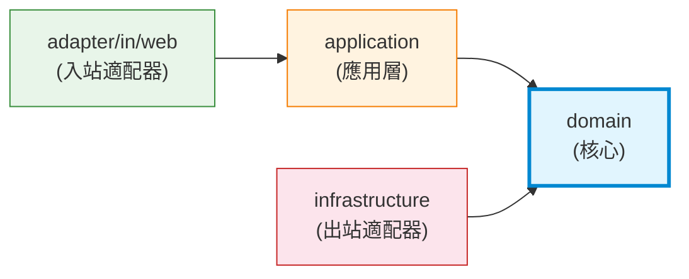

> **重點**：所有箭頭指向 `domain`。Domain 不知道也不依賴 Spring Framework、MyBatis、Redis、Kafka、HTTP 等任何外部技術。

---

## SOLID 原則對照

| 原則 | 展現方式 | 對應程式碼 |
|---|---|---|
| **S** — 單一職責 | 每個 Handler 只處理一種 Command/Query | `StartProductionCommandHandler` 只負責開始生產 |
| **O** — 開放封閉 | 新增功能只需新增 Handler，不修改既有程式碼 | 新增 `PauseProductionCommand` + Handler 即可 |
| **L** — 里氏替換 | InMemory / MyBatis / Redis Repository 可互換 | `EquipmentRepository` 介面，任何實作皆可替換 |
| **I** — 介面隔離 | `CommandBus` 與 `QueryBus` 分離、`CachePort` 獨立 | 讀寫端各自獨立的介面 |
| **D** — 依賴反轉 | Domain 定義 Port，Infrastructure 實作 Adapter | `CachePort`(介面) ← `RedisCacheAdapter`(實作) |

---

## 測試策略

每個模組包含不同層級的測試，**所有測試使用 AssertJ + `@DisplayName` 中文描述**：

| 測試類型 | 適用模組 | 說明 |
|---|---|---|
| **Unit Test** | 全部 | Domain Model 行為、VO 驗證、Specification、Handler 邏輯 |
| `@SpringBootTest` | Module 1, 3, 5, 7, 8 | Application Service、Repository Adapter、Context 載入 |
| `@WebMvcTest` | Module 2, 5, 7, 8 | MockMvc 測試 Controller + 驗證 + 例外處理 |
| `@WebMvcTest + Security` | Module 5 | `@WithMockUser`、401/403 測試 |
| `@SpringBootTest + WebTestClient` | Module 6 | WebFlux Gateway 路由、Fallback 測試 |
| `@SpringBootTest + H2` | Module 3 | MyBatis Mapper CRUD、Repository 完整流程 |
| Embedded Kafka | Module 4 | 端到端事件流、序列化 / 反序列化 |
| Mock RedisTemplate | Module 7 | 快取操作驗證（不需真實 Redis） |
| Disabled Nacos/Sentinel | Module 8 | 停用外部服務的自動配置 |

### 測試範例：@WithMockUser (Module 5)

```java
@WebMvcTest(UserCommandController.class)
class UserCommandControllerTest {

    @Autowired private MockMvc mockMvc;
    @MockBean private CommandBus commandBus;

    @Test
    @WithMockUser(roles = "ADMIN")  // 模擬 ADMIN 角色
    @DisplayName("ADMIN 可以鎖定使用者帳號")
    void lockUser_asAdmin_shouldReturn200() throws Exception {
        mockMvc.perform(put("/api/v1/users/123/lock")
                .contentType(MediaType.APPLICATION_JSON)
                .content("{\"reason\":\"違規操作\"}"))
            .andExpect(status().isOk());
    }

    @Test
    @WithMockUser(roles = "OPERATOR")  // 模擬 OPERATOR 角色
    @DisplayName("OPERATOR 不可鎖定使用者帳號 — 403")
    void lockUser_asOperator_shouldReturn403() throws Exception {
        mockMvc.perform(put("/api/v1/users/123/lock")
                .contentType(MediaType.APPLICATION_JSON)
                .content("{\"reason\":\"違規操作\"}"))
            .andExpect(status().isForbidden());
    }
}
```

### 測試範例：Cache-aside (Module 7)

```java
@Test
@DisplayName("Cache hit — 直接從快取回傳，不查 Repository")
void handle_cacheHit_shouldReturnCachedResult() {
    DashboardView cached = createSampleView();
    when(cachePort.get("dashboard:LINE-A", DashboardView.class)).thenReturn(cached);

    DashboardView result = handler.handle(new GetDashboardQuery("LINE-A"));

    assertThat(result).isEqualTo(cached);
    verify(repository, never()).findLatestByLineId(anyString());  // 不查 DB！
}

@Test
@DisplayName("Cache miss — 查 Repository 後存入快取")
void handle_cacheMiss_shouldLoadFromRepoAndCache() {
    when(cachePort.get("dashboard:LINE-A", DashboardView.class)).thenReturn(null);
    when(repository.findLatestByLineId("LINE-A")).thenReturn(Optional.of(metrics));

    DashboardView result = handler.handle(new GetDashboardQuery("LINE-A"));

    verify(cachePort).put(eq("dashboard:LINE-A"), any(DashboardView.class), eq(1800L));
}
```

---

## 微服務全景圖

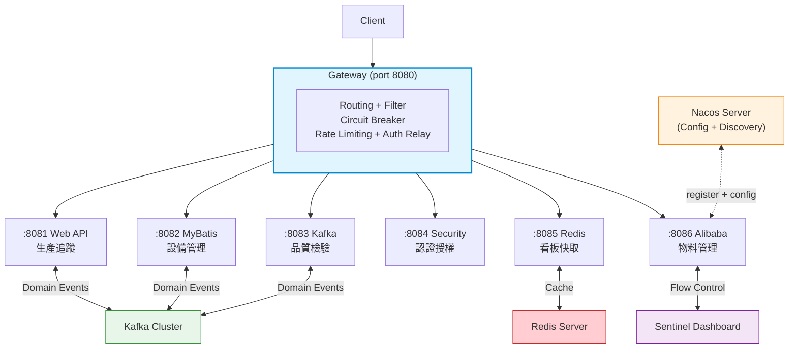

---

## 學習路線建議

### 路線圖

```mermaid
flowchart LR
    subgraph 基礎路線["基礎路線 (必修)"]
        S1["Step 1<br/>common<br/>DDD 基礎類別"] --> S2["Step 2<br/>boot-basics<br/>Spring Boot 基礎"]
        S2 --> S3["Step 3<br/>web-api<br/>REST + CQRS"]
    end

    subgraph 進階路線["進階路線 (選修，可並行)"]
        SEC["security<br/>認證授權"]
        GWY["gateway<br/>API 閘道"]
        MYB["mybatis<br/>持久層"]
        KFK["kafka<br/>事件驅動"]
        RDS["redis<br/>快取"]
        ALI["alibaba<br/>微服務治理"]
    end

    S3 --> SEC
    S3 --> GWY
    S3 --> MYB
    S3 --> KFK
    S3 --> RDS
    S3 --> ALI

    style 基礎路線 fill:#e1f5fe,stroke:#0288d1
    style 進階路線 fill:#e8f5e9,stroke:#388e3c
```

### 依主題的學習組合

| 學習目標 | 建議模組 | 順序 |
|---|---|---|
| DDD 入門 | common → boot-basics | 1 → 2 |
| REST API 開發 | common → web-api | 1 → 3 |
| 完整 CQRS | common → web-api → mybatis | 1 → 3 → 4 |
| 持久層整合 | common → mybatis | 1 → 4 |
| 事件驅動架構 | common → kafka | 1 → 5 |
| 安全認證 | common → web-api → security | 1 → 3 → 6 |
| 微服務閘道 | web-api → gateway | 3 → 7 |
| 快取策略 | common → redis | 1 → 8 |
| 微服務治理 | common → cloud-alibaba | 1 → 9 |
| 完整微服務 | 全部 | 1 → 2 → 3 → 4 → 5 → 6 → 7 → 8 → 9 |

### 每個模組建議閱讀順序

1. `domain/model/` — 先看 Aggregate Root 和 Value Object
2. `domain/event/` — 看有哪些 Domain Event
3. `domain/repository/` — 看 Port Interface 定義
4. `application/` — 看 Use Case 如何編排
5. `infrastructure/` — 看技術實作如何接上 Port
6. `adapter/in/web/` — 看入站適配器
7. `src/test/` — **所有測試都是最好的文件**，從測試理解行為

---

## 常見問題

### Q: 為什麼每個模組都有自己的 SimpleCommandBus？

每個模組是獨立的 Spring Boot 應用（獨立 JVM），各自的 CommandHandler 只在自己的 Spring Context 中。這是微服務架構的本質 — 每個服務獨立部署、獨立執行。

### Q: Domain 層真的沒有 Spring 依賴嗎？

是的。`domain/` 套件下只用純 Java + mes-common 的基類。你可以用 `grep -r "import org.springframework" mes-web-api/src/main/java/com/mes/web/production/domain/` 驗證 — 不會找到任何 Spring import。

### Q: 為什麼 Module 6 (Gateway) 不能用 OpenFeign？

Spring Cloud Gateway 基於 WebFlux（響應式），而 OpenFeign 基於 WebMVC（命令式）。兩者不能在同一個 Spring Boot 應用中共存。Gateway 內用 `WebClient` 做服務呼叫。Feign 的範例放在 `feign/reference/` 作為教學參考。

### Q: Module 8 測試如何不啟動 Nacos/Sentinel？

透過測試屬性停用自動配置：
```java
@SpringBootTest(properties = {
    "spring.cloud.nacos.discovery.enabled=false",
    "spring.cloud.nacos.config.enabled=false",
    "spring.cloud.sentinel.enabled=false"
})
```

### Q: Redis 測試需要啟動 Redis 嗎？

不需要。所有 Redis 測試都使用 Mock（Mockito mock `RedisTemplate`）或 Spring 的 `ConcurrentMapCacheManager` 替代。

---

## 授權

本專案僅供教學用途。
